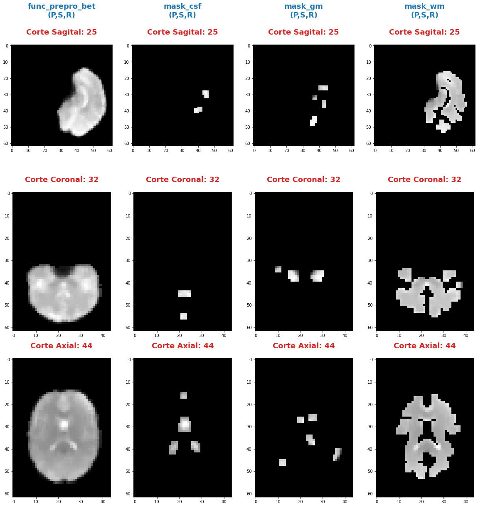
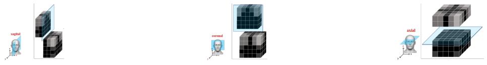
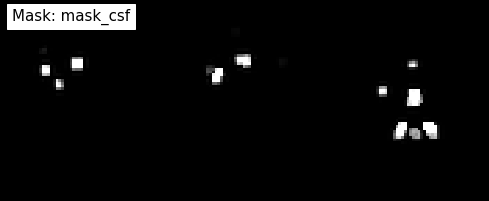
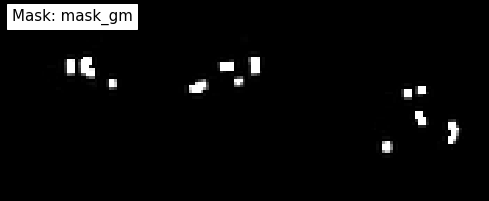
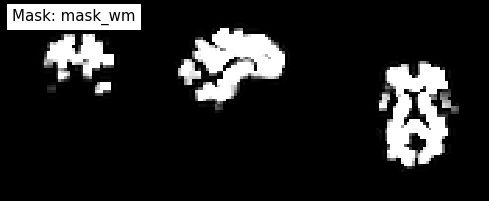

---

---

***Andres Eduardo Aracena Rangel***

*Estudiante del programa del Magister en Física Médica*

---

---

El siguiente Script de Python forma parte del trabajo especial de grado.


Profesora Guía:

*PhD María Daniela Cornejo*

---

---

&nbsp;
Con referencia:

- [Pagina oficial NIbabel](https://nipy.org/nibabel/index.html) 

Imagenes de fMRI extraidas de OpenNuero:
 
 - [ds002422](https://openneuro.org/datasets/ds002422/versions/1.1.0)
 
---

---

 Acronimos:

- CSF: Cerebrospinal Fluid (*líquido cefalorraquídeo*)
- GM: Gray Matter (*materia gris*)
- WM: White Matter (*materia blanca*)

---

---

NOTA:
Cuando indiquemos imagenes brain o mascaras brain, nos estamos refieriendo a las imagenes o mascaras de csf, wm, gm

# Extracción serie de tiempo promedio de mascaras csf, gm y wm

Del notebook **workflow_preprocesamiento_iterables_maskref.ipynb** se extrajo las mascaras para csf, gm y wm para tres umbrales *0.5, 0.9 y 0.99: y en el notebook **serie_tiempo_masks_4D_CSFgmWM.ipynb** se extrajo series de tiempo para las mascaras y sus umbrales.

En este notebook solo trabajaremos con las mascaras de csf, gm y wm pafa el umbral de 0.99, donde extraeremos su serie de tiempo promedio

&nbsp;
## Importamos librerias


```python
import time # medir el tiempo de ejecución de nuestros programas
start = time.process_time()
inicio = time.time()
```


```python
import os # El módulo os nos permite acceder a funcionalidades dependientes del Sistema Operativo
from os.path import join as opj # Este método concatena varios componentes de ruta con exactamente un separador de directorio(‘/’)

from nipype import SelectFiles

import nibabel as nib
import numpy as np
import matplotlib.pyplot as plt

import pandas as pd

from nilearn.plotting import plot_anat
%matplotlib inline
```

    220720-02:07:46,604 nipype.utils WARNING:
    	 A newer version (1.8.3) of nipy/nipype is available. You are using 1.7.0


    /home/aracena/.local/lib/python3.9/site-packages/nilearn/datasets/__init__.py:93: FutureWarning: Fetchers from the nilearn.datasets module will be updated in version 0.9 to return python strings instead of bytes and Pandas dataframes instead of Numpy arrays.
      warn("Fetchers from the nilearn.datasets module will be "


## Definimos parámetros


```python
'''
Ruta del directorio de la data
'''
path_data = '/home/aracena/thesis_ds002422/' 

'''
Ruta donde reposa la imagen funcional preprocesada con bet
'''
path_fmri = opj(path_data,'02_fase1_extraccion_brain_fmri_prepro','output')

'''
Ruta mascaras brain
'''
path_brain = opj(path_data,'01_fase1_extraccion_mask_brain','output','datasink','masks_brain')


'''
Ruta donde reposan las imagenes de referencia de los cortes anatomicos
'''
path_ref = opj(path_data,'03_fase2_extraccion_series_tiempo_brain', 'imagenes')


'''
lista de tejidos a procesar
'''
tejido = ['mask_csf', 'mask_gm', 'mask_wm']

        
'''
Ingrese el umbral que desea extraer (se extrajeron tres mask brain para tres umbrales distintos)
'''
umbral_sel = '0.95'

'''
Ruta donde se guardaran los resultados
'''
path_out = opj(path_data,'03_fase2_extraccion_series_tiempo_brain','output', umbral_sel)

# Ruta donde se guardara archivos csv
path_csv = opj(path_out,'archivos_csv')

# Ruta donde se guardaran las imagenes png
path_png = opj(path_out,'archivos_png')

'''
Creamos la carpeta de salida
'''
os.system('mkdir -p %s'%path_out)
os.system('mkdir -p %s'%path_csv)
os.system('mkdir -p %s'%path_png)

'''
Creamos la carpeta de salida para tablas
'''
path_out_DF = opj(path_out,'tablas_proyecto')
os.system('mkdir -p %s'%path_out_DF);
```

## Definimos funciones

### Función para extraer los atributos de la(s) imagen(es)


```python
'''
Función para extraer los atributos de la(s) imagen(es).

Inputs:

- img: Diccionario con las imagenes nifti

Output:

df_atri: Dataframe con los principales atributos de las imagenes contenidas en el diccionario 'img'
'''

def atributo_img(img):
    import pandas as pd
    lista_img = list(img.keys()) # Creamos una lista con las claves del diccionario

    df_atri = pd.DataFrame()
    df_atri.index = ['forma', 'dimension', 'orientacion', '', 'x_img', 'y_img' , 'z_img', 'volumenes_(N)', 'voxel_size_(mm)', 
                       'TR_(s)', 'tipo_dato', 'numero_voxels','min_img', 'max_img']
    
    for i, ima in enumerate(lista_img):
        lista_atri = []
        #cargamos el header de la imagen
        header_img = img[ima].header
        
        # Forma y dimensión de la imágen
        forma = header_img.get_data_shape() 
        lista_atri.append(str(forma))
        lista_atri.append(len(forma))
        
        # Orientacion de la imágen
        orientacion = nib.orientations.aff2axcodes(img[ima].affine)
        lista_atri.append(orientacion)

        # x, y, z y volumenes
        ejes=[]
        for i in range(len(orientacion)):
            tam = img[ima].shape[i]
            ori = str(orientacion[i])
            if  ori == 'L'or ori == 'R':
                x_img = tam
                a = 'x'

            elif ori == 'A' or ori == 'P':
                y_img = tam
                a = 'y'

            elif ori == 'I'or ori == 'S':
                z_img = tam
                a = 'z'
                
            ejes.append(a)
        
        # Agregamos a la lista de atributos forma, x, y, z
        lista_atri.append(ejes)
        lista_atri.append(x_img)
        lista_atri.append(y_img)
        lista_atri.append(z_img)
        
        # Agregamos volumes a la lista de atributos 
        if len(forma) == 4:
            lista_atri.append(forma[-1])
        else:
            lista_atri.append('1')

        # Tamaño del voxel
        tavo = header_img.get_zooms()[0:3]
        
        tamvox=[]
        for i in range(len(tavo)):
            tamvox.append(round(tavo[i],3))
            
        lista_atri.append(tamvox) 
        
        # Tiempo de exploración
        if len(header_img.get_zooms()) == 4:
            lista_atri.append(header_img.get_zooms()[-1])
        else:
            lista_atri.append('---')     
        
        
        #lista_atri.append(header_img.get_zooms()[-1])   # Tiempo de exploración
        lista_atri.append(header_img.get_data_dtype())   # Tipo de datos numérico
        lista_atri.append(img[ima].get_fdata().size) # Número de elementos de la matriz
        lista_atri.append(round(img[ima].get_fdata().min(),2)) # Valor minimo de la imágen
        lista_atri.append(round(img[ima].get_fdata().max(),2)) # Valor maximio de la imágen
        
        # Creamos DF de atributos de la imagen
        df_at = pd.DataFrame()
        df_at = pd.DataFrame(lista_atri)
        df_at.columns = [ima]
        df_at.index = df_atri.index
        #display(df_at)

        # Unimos las DF
        df_atri = pd.merge(df_atri, df_at,
                           right_index=True,left_index=True)
    return df_atri
```

### Funcion para visualizar y guardar los cortes anatomicos sobre un voxel


```python
'''
Función para generar la visualización de los cortes anatómico de varias imágenes (hasta cuatro) 

Inputs:

- img: Diccionario con las imágenes nifti
- vol: Volumen donde se desea visualizar los cortes anatómicos
- vox: Posición i,j,k del voxel sobre el cual se proyectarán los cortes
#- nom_img = nombre de la imagen con que se desea visualizar y guardar

Outputs:
- plot de los diferentes cortes anatómicos sobre un voxel de las imágenes ingresadas en 'img'
'''

def visual_cortes_ana(img, vol, voxel):
    import nibabel as nib
    import numpy as np
    import matplotlib.pyplot as plt
    import matplotlib.image as mpimg
   
    # Creamos una lista con las claves del diccionario ingresado
    lista_img = list(img.keys())

    corte_sag = {}
    corte_cor = {}
    corte_axi = {}
    datos_img = {}
    x_cor = {}
    y_cor = {}
    z_cor = {}
    nomb_ori={}
    for i, ima in enumerate(lista_img):
        # Orientacion de la imágen
        orientacion = nib.orientations.aff2axcodes(img[ima].affine)
        # creamos un nombre para la grafica
        a = ','.join(orientacion)
        nomb_ori[ima] = '('+ a +')'
        
        #cargamos datos de la imagen
        datos_img[ima] = img[ima].get_fdata()
        ta = len(datos_img[ima].shape)
        if ta == 4:
            datos_img[ima] = datos_img[ima][...,vol]
        else:
            datos_img[ima] = datos_img[ima][...]

        #se extraen valores x, y, z del voxel ingresado y cortes segun posición anatómica
        for j in range(len(orientacion)):
            ori = str(orientacion[j])

            if  ori == 'L'or ori == 'R':
                x_cor[ima] = voxel[j]
                
                # corte segun posición anatómica
                if j == 0:
                    corte_sag[ima] = datos_img[ima][x_cor[ima],:,:]
                elif j == 1:
                    corte_sag[ima] = datos_img[ima][:,x_cor[ima],:]
                elif j == 2:
                    corte_sag[ima] = datos_img[ima][:,:,x_cor[ima]]

            elif ori == 'A' or ori == 'P':
                y_cor[ima] = voxel[j]
                
                # corte segun posición anatómica
                if j == 0:
                    corte_cor[ima] = datos_img[ima][y_cor[ima],:,:]
                elif j == 1:
                    corte_cor[ima] = datos_img[ima][:,y_cor[ima],:]
                elif j == 2:
                    corte_cor[ima] = datos_img[ima][:,:,y_cor[ima]]

            elif ori == 'I'or ori == 'S':
                z_cor[ima] = voxel[j]
                
                # corte segun posición anatómica
                if j == 0:
                    corte_axi[ima] = datos_img[ima][z_cor[ima],:,:]
                elif j == 1:
                    corte_axi[ima] = datos_img[ima][:,z_cor[ima],:]
                elif j == 2:
                    corte_axi[ima] = datos_img[ima][:,:,z_cor[ima]]
    
    # Definimos estilo de letra para la grafica
    font1 = {'fontsize':18, 'fontweight':'bold', 'color':'tab:blue'}
    font2  = {'fontsize':18, 'fontweight':'bold', 'color':'tab:red'}
    
    if (len(lista_img))==1:
        #Graficamos
        nom = lista_img[0] + '\n' + nomb_ori[lista_img[0]]

        fig, axes = plt.subplots(1,3, figsize=(15, 15))
        fig.suptitle(nom, fontweight ="bold", fontsize = 22, color = 'tab:blue')
        axes[0].imshow(corte_sag[ima], cmap = 'gray')
        axes[1].imshow(corte_cor[ima], cmap = 'gray')
        axes[2].imshow(corte_axi[ima], cmap = 'gray')
        for i in range(3):
            axes[i].axis('off')

        # Titulos de las graficas
        titulo =['Corte Sagital: '+ str(x_cor[ima]) + '\n', 
                 'Corte Coronal: '+ str(y_cor[ima]) + '\n',
                 'Corte Axial: '+ str(z_cor[ima]) + '\n']

        for i, title in enumerate(titulo):
            axes[i].set_title(title, fontdict=font2)

        plt.subplots_adjust(#left=0.5,
                        #bottom=0.5, 
                        #right=0.7,
                        hspace=0.3,
                        top=1.26)
        fig.patch.set_facecolor('xkcd:white')
        plt.show()
    
    else:
        # Graficamos
        fig, axes = plt.subplots(3, len(lista_img),figsize=(20, 20))
        for i, im in enumerate(lista_img):
            axes[0,i].imshow(corte_sag[im], cmap = 'gray')
            axes[1,i].imshow(corte_cor[im], cmap = 'gray')
            axes[2,i].imshow(corte_axi[im], cmap = 'gray')

        
            # Identificamos los cortes
            titulo =['Corte Sagital: '+ str(x_cor[im]) + '\n', 
                     'Corte Coronal: '+ str(y_cor[im]) + '\n',
                     'Corte Axial: '+ str(z_cor[im]) + '\n']

            for j, title in enumerate(titulo):
                axes[j,i].xaxis.set_label_position('top')
                axes[j,i].set_xlabel(title, fontdict=font2)
            

        # Titulos que que identifica la imagen y la orientacion
        for i,im in enumerate(lista_img):
            axes[0,i].set_title((im+'\n'+nomb_ori[im]+'\n'), 
                                fontdict=font1)
        
        #for j in range(3):
            #for i in range(2):
                #axes[j,i].axis('off')

    
        plt.subplots_adjust(#left=0.5,
                            #bottom=0.5, 
                            #right=0.7,        
                            #hspace=0.3,
                            top=0.91)
    plt.show()
    
    # cargamos imagen de referencia de los cortes anatomicos
    img_cor_sag = mpimg.imread(opj(path_ref,'corte_sagital.png'))
    img_cor_cor = mpimg.imread(opj(path_ref,'corte_coronal.png'))
    img_cor_axi = mpimg.imread(opj(path_ref,'corte_axial.png'))

    img_cor = [img_cor_sag,img_cor_cor,img_cor_axi]

    fig, axes = plt.subplots(1,3, figsize=(2,2))
    for i,imco in enumerate(img_cor):
        axes[i].imshow(img_cor[i])
        axes[i].axis('off')

    # para cambiar el espacio entre las subtramas de Matplotlib
    plt.subplots_adjust(left=0, 
                        bottom=0.1,  
                        right=7,  
                        top=0.9,  
                        wspace=1,  
                        hspace=0.4)
    #fig.tight_layout()
    fig.patch.set_facecolor('xkcd:white')
    plt.plot()
```

### Funcion que recorre los voxels y extrae series de tiempos: Imagenes 4D o mascaras binarias


```python
'''
Función que recorre voxel a voxel y extrae sus series de tiempo de las imagens 4D y de las mascaras binarias 
o su convulion con imagenes 4D. Se requiere input:

- datos_img = datos de la imagen 4D a procesar
- binaria = si es una mascara o convolución, su valor es de 1
            si es una imagen anatomica o funcional, su valor es 0
'''

def vox_all(datos_img, binaria):    
    import numpy as np
    
    x_img=datos_img.shape[2] 
    y_img=datos_img.shape[1] 
    z_img=datos_img.shape[0] 
    tf=datos_img.shape[3]
    
    # creamos listas para luego ser guardadas en DF
    pos_vox = [] #posicion dl voxel
    ser_vox = [] #series de tiempo
    ser_vox_nor = [] #series de tiempo normalizada
    ser_etiq = [] #etiquetas de los voxels
    #voxel_norm_glob = []
    #mean = []    
      
    n = 0
    p = 0
    etiqueta = 0
    for k in range(z_img):
        for j in range(y_img):
            for i in range(x_img):                
                val_eva = datos_img[k, j, i, 0] #valor del voxel en la posicion x,y,z
                
                if val_eva == 0:
                    if binaria == 1:
                        n = n
                        etiqueta += 1
                        continue
                
                # lista de la posición del voxel y su etiqueta
                pos_vox.append([etiqueta, k, j, i])
                                
                #lista de las series de tiempo de cada voxel                
                valu_voxel = datos_img[k, j, i, :]
                ser_vox.append(valu_voxel)
                
                # normalizamos
                dividendo = (np.amax(valu_voxel)-np.amin(valu_voxel))
                if dividendo == 0:
                    #print(i,j,k)
                    w = np.zeros(tf,dtype='float')
                    ser_vox_nor.append(w)
                    #mean.append(mean_voxel)
                    p = p+1
                    n = n+1
                else:                    
                    ser_vox_nor.append((valu_voxel-np.amin(valu_voxel))/dividendo)     
                    #mean.append(mean_voxel)
                    n = n+1
                
                # lista de la etiqueta del voxels recorrido
                ser_etiq.append(etiqueta)
                etiqueta += 1
                
    
    # Creamos DF de la posición del voxel
    df_pos_vox = pd.DataFrame(pos_vox)
    df_pos_vox.columns = ['voxel/serie', 'z', 'y', 'x']
    
    # Creamos DF de las series de tiempo
    df_ser_vox = pd.DataFrame(ser_vox)
    df_ser_vox.index = [ser_etiq]
    
    # Creamos DF de las series de tiempo normalizadas
    df_ser_vox_nor = pd.DataFrame(ser_vox_nor)
    df_ser_vox_nor.index = [ser_etiq]
            
    return df_pos_vox, df_ser_vox, df_ser_vox_nor, n, p
```

### Función para graficar series de tiempo


```python
'''
Función grafica las series de tiempo de una DF introducida. Se requiere input:

- df_data = Dataframe que contiene las series de tiempo
- name_save = nombre con que desea guardar el grafico
'''

def plot_series_time(df_data, name_save): 
    # Creamos una lista con las claves del diccionario ingresado
    tejido = list(df_data.keys())
    # definimos una ventana
    vent_min = 50
    vent_max = 75


    font1 = {'fontsize':14, 'fontweight':'bold', 'color':'tab:blue'}
    font2  = {'fontsize':18, 'fontweight':'bold', 'color':'tab:red'}
    titulo = "Promedio de las series de tiempo csf y wm normalizados"

    fig, ax = plt.subplots(figsize = (17,8))
    for i,tisue in enumerate(tejido):
        if i == 1:
            ax.plot(df_data[tisue], linewidth=2, label=tisue)
        else:           
            ax.plot(df_data[tisue], '--.', linewidth=2, label=tisue)

    ax.legend()
    ax.set_xlabel('Tiempo',fontdict=font1)
    ax.set_ylabel('Señal fMRI',fontdict=font1)
    ax.set_title(titulo, fontdict = font2)
    ax.grid(axis = 'x', color = 'gray', linestyle = 'dashed')
    ax.grid(axis = 'y', color = 'gray', linestyle = 'dashed')
    ax.axvspan(vent_min,vent_max, alpha=0.3, facecolor='y')

    plt.savefig(opj(path_png, name_save))
```

## Cargamos imagen funcional preprocesada con bet y datos de la  imagen funcional


```python
img_func = 'fmri_prepro_bet.nii.gz'
img_func_orig = nib.load(opj(path_fmri,img_func)) # Cargamos imagen nifti
datos_func_orig = img_func_orig.get_fdata()       # Cargamos datos de la imagen
datos_func_orig.shape
```


    (62, 62, 44, 196)


## Diccionario: Crear diccionario general de la imagenes y datos a procesar

El objetivo de guardar las imagenes y datos de las imagenes a procesar (imagenes funcional y mascaras brain) es para luego poder utilizar los respectivos datos de manera sencilla en bucles.
Se crea los siguientes diccionario general:

- 'img': para guaradar las imagenes a procesar
- 'datos_img': para guardar los datos de las imagenes a procesar

### Diccionario: Agregar imagen y datos de la imagen funcional al diccionario general


```python
img = {'func_prepro_bet': img_func_orig}
datos_img = {'func_prepro_bet' : datos_func_orig}
```


```python
type(img)
```


    dict


## Cargamos imagen y datos de la imagenes de las mascaras brain

### Interfaz SelectFiles - mascaras brain

En esta oprtunidad, trabajaremos con interfaces y no con nodos, ya que queremos trabajar directamente y visualizar las mascaras.

Extramos las rutas de las mascaras para los umbrales previamente calculo en el notebook **01_fase1_extraccion_mask_brain**


```python
# La entrada template indica la plantilla de cadena que debe coincidir en el directorio indicado a buscar
templates = {'mask_brain': 'mask_ext_*/threshold_{umbral}/fmri_rest_prepro.nii.gz'}
       
selectfiles = SelectFiles(templates)


'''
Inputs
- Ubicación de la carpeta del conjunto de datos
- Cadenas de marcador de posición {}
'''
# La entrada base_directory indica en que directorio buscar
selectfiles.inputs.base_directory = path_brain

#Ingresamos la(s) cadena(s) de marcador de posición {} con valores
selectfiles.inputs.umbral = umbral_sel

#selectfiles.inputs.tejido = [tejido]
#get_mask_ext.iterables = ('mask_ext', mask_ext)

# ejecutamos 
brain_mask = selectfiles.run().outputs
```


```python
brain_mask
```


    
    mask_brain = ['/home/aracena/thesis_ds002422/01_fase1_extraccion_mask_brain/output/datasink/masks_brain/mask_ext_csf/threshold_0.95/fmri_rest_prepro.nii.gz', '/home/aracena/thesis_ds002422/01_fase1_extraccion_mask_brain/output/datasink/masks_brain/mask_ext_gm/threshold_0.95/fmri_rest_prepro.nii.gz', '/home/aracena/thesis_ds002422/01_fase1_extraccion_mask_brain/output/datasink/masks_brain/mask_ext_wm/threshold_0.95/fmri_rest_prepro.nii.gz']


### Diccionarios para los mascaras tejido-umbrales


```python
mask = dict(zip(tejido,brain_mask.mask_brain))
print('mask\n', mask)
```

    mask
     {'mask_csf': '/home/aracena/thesis_ds002422/01_fase1_extraccion_mask_brain/output/datasink/masks_brain/mask_ext_csf/threshold_0.95/fmri_rest_prepro.nii.gz', 'mask_gm': '/home/aracena/thesis_ds002422/01_fase1_extraccion_mask_brain/output/datasink/masks_brain/mask_ext_gm/threshold_0.95/fmri_rest_prepro.nii.gz', 'mask_wm': '/home/aracena/thesis_ds002422/01_fase1_extraccion_mask_brain/output/datasink/masks_brain/mask_ext_wm/threshold_0.95/fmri_rest_prepro.nii.gz'}


### Diccionario: Cargamos imagenes nifti de mascaras


```python
lista_brain = list(mask.keys()) # extraemos una lista de las mascaras

img_mask = {}
for i, tisue in enumerate(lista_brain):
    img_mask[tisue] = nib.load(mask[tisue])

print(img_mask['mask_csf'].shape)
print(img_mask['mask_wm'].shape)
print(img_mask['mask_gm'].shape)

```

    (62, 62, 44, 196)
    (62, 62, 44, 196)
    (62, 62, 44, 196)


```python
img_mask
```


    {'mask_csf': <nibabel.nifti1.Nifti1Image at 0x7fa7082beb50>,
     'mask_gm': <nibabel.nifti1.Nifti1Image at 0x7fa7082be5b0>,
     'mask_wm': <nibabel.nifti1.Nifti1Image at 0x7fa7082be070>}


### Diccionario: cargamos datos de mascaras


```python
datos_img_mask = {}
for i, tisue in enumerate(lista_brain):
    datos_img_mask[tisue] = img_mask[tisue].get_fdata()

print(datos_img_mask['mask_wm'].shape)
```

    (62, 62, 44, 196)


## Diccionario: Agregamos las imagenes y datos de las imagenes da las mascaras brain al diccionario general


```python
'''
Para añadir los pares clave-valor de un diccionario a otro, empleamos el método update().
'''

img.update(img_mask)
datos_img.update(datos_img_mask)
```


```python
print(img)
```

    {'func_prepro_bet': <nibabel.nifti1.Nifti1Image object at 0x7fa7082c6af0>, 'mask_csf': <nibabel.nifti1.Nifti1Image object at 0x7fa7082beb50>, 'mask_gm': <nibabel.nifti1.Nifti1Image object at 0x7fa7082be5b0>, 'mask_wm': <nibabel.nifti1.Nifti1Image object at 0x7fa7082be070>}


## Extraemos los atributos de las imagen(es)


```python
'''
Creamos diccionario de las imagenes (img) y datos de imagenes (datos_img)
'''
# Ya los diccionario img y datos_img estan creados en la lineas anteriores

'''
Ejecutamos la función atributo_img()
'''
atributo = atributo_img(img=img)
atributo
```


<div>
<style scoped>
    .dataframe tbody tr th:only-of-type {
        vertical-align: middle;
    }

    .dataframe tbody tr th {
        vertical-align: top;
    }

    .dataframe thead th {
        text-align: right;
    }
</style>
<table border="1" class="dataframe">
  <thead>
    <tr style="text-align: right;">
      <th></th>
      <th>func_prepro_bet</th>
      <th>mask_csf</th>
      <th>mask_gm</th>
      <th>mask_wm</th>
    </tr>
  </thead>
  <tbody>
    <tr>
      <th>forma</th>
      <td>(62, 62, 44, 196)</td>
      <td>(62, 62, 44, 196)</td>
      <td>(62, 62, 44, 196)</td>
      <td>(62, 62, 44, 196)</td>
    </tr>
    <tr>
      <th>dimension</th>
      <td>4</td>
      <td>4</td>
      <td>4</td>
      <td>4</td>
    </tr>
    <tr>
      <th>orientacion</th>
      <td>(P, S, R)</td>
      <td>(P, S, R)</td>
      <td>(P, S, R)</td>
      <td>(P, S, R)</td>
    </tr>
    <tr>
      <th></th>
      <td>[y, z, x]</td>
      <td>[y, z, x]</td>
      <td>[y, z, x]</td>
      <td>[y, z, x]</td>
    </tr>
    <tr>
      <th>x_img</th>
      <td>44</td>
      <td>44</td>
      <td>44</td>
      <td>44</td>
    </tr>
    <tr>
      <th>y_img</th>
      <td>62</td>
      <td>62</td>
      <td>62</td>
      <td>62</td>
    </tr>
    <tr>
      <th>z_img</th>
      <td>62</td>
      <td>62</td>
      <td>62</td>
      <td>62</td>
    </tr>
    <tr>
      <th>volumenes_(N)</th>
      <td>196</td>
      <td>196</td>
      <td>196</td>
      <td>196</td>
    </tr>
    <tr>
      <th>voxel_size_(mm)</th>
      <td>[4.0, 4.0, 4.0]</td>
      <td>[4.0, 4.0, 4.0]</td>
      <td>[4.0, 4.0, 4.0]</td>
      <td>[4.0, 4.0, 4.0]</td>
    </tr>
    <tr>
      <th>TR_(s)</th>
      <td>3.56</td>
      <td>3.56</td>
      <td>3.56</td>
      <td>3.56</td>
    </tr>
    <tr>
      <th>tipo_dato</th>
      <td>float32</td>
      <td>float32</td>
      <td>float32</td>
      <td>float32</td>
    </tr>
    <tr>
      <th>numero_voxels</th>
      <td>33150656</td>
      <td>33150656</td>
      <td>33150656</td>
      <td>33150656</td>
    </tr>
    <tr>
      <th>min_img</th>
      <td>0.0</td>
      <td>0.0</td>
      <td>0.0</td>
      <td>0.0</td>
    </tr>
    <tr>
      <th>max_img</th>
      <td>941.74</td>
      <td>941.74</td>
      <td>835.97</td>
      <td>890.82</td>
    </tr>
  </tbody>
</table>
</div>


```python
atributo['func_prepro_bet']['x_img']
```


    44


## Visualizamos los cortes anatomicos de las imagenes


```python
visual_cortes_ana(img= img,
                  vol= 40, 
                  voxel= (32,44,25))
```


    

    


    

    


### Visualizamos con plot_anat


```python
# elegimos un volumen
vol = 40

lista_vis = list(img.keys()) # extraemos una lista de las mascaras

vol_vis = {}
for i, mas in enumerate(lista_vis):
    vol_vis[mas] = img[mas].slicer[...,vol]

for i, mas in enumerate(lista_vis):
    plot_anat(vol_vis[mas], title='Mask: '+mas, 
              cut_coords=(10,10,10), display_mode='ortho', 
              dim=-1, draw_cross=False, annotate=False);
```


    

    


    

    


    

    


    

    


## Extraemos todas las series de tiempo de la imagen funcional.

### Aplicamos funcion vox_all


```python
'''
Ejecutamos la función vox_all
'''
res = vox_all(datos_img=datos_img['func_prepro_bet'], 
              binaria=0)

'''
Cargamos la posición de los voxels
'''
vox_pos_func = res[0]

'''
Cargamos los valores de los voxels
'''
voxel_val_func = res[1]

'''
Cargamos los valores de los voxels normalizado
'''
voxel_norm_func = res[2]

'''
Cargamos el numero de voxels en la masacara
'''
vox_num_func= res[3]

print('--------------------------------------------\n' )
print('numero de voxels de la imagen funcional:\n', vox_num_func)

'''
Cargamos el numero de voxels donde la series es de cero
'''

ceros_func = res[4]
print('\n-------------------------------------------\n')
print('cantidad de voxel series ceros:\n',ceros_func)
print('\n-------------------------------------------')
```

    --------------------------------------------
    
    numero de voxels de la imagen funcional:
     169136
    
    -------------------------------------------
    
    cantidad de voxel series ceros:
     146180
    
    -------------------------------------------


```python
pd.options.display.max_columns = 15 # para mejorar la visualización del DataFrame

voxel_val_func
```


<div>
<style scoped>
    .dataframe tbody tr th:only-of-type {
        vertical-align: middle;
    }

    .dataframe tbody tr th {
        vertical-align: top;
    }

    .dataframe thead th {
        text-align: right;
    }
</style>
<table border="1" class="dataframe">
  <thead>
    <tr style="text-align: right;">
      <th></th>
      <th>0</th>
      <th>1</th>
      <th>2</th>
      <th>3</th>
      <th>4</th>
      <th>5</th>
      <th>6</th>
      <th>...</th>
      <th>189</th>
      <th>190</th>
      <th>191</th>
      <th>192</th>
      <th>193</th>
      <th>194</th>
      <th>195</th>
    </tr>
  </thead>
  <tbody>
    <tr>
      <th>0</th>
      <td>0.0</td>
      <td>0.0</td>
      <td>0.0</td>
      <td>0.0</td>
      <td>0.0</td>
      <td>0.0</td>
      <td>0.0</td>
      <td>...</td>
      <td>0.0</td>
      <td>0.0</td>
      <td>0.0</td>
      <td>0.0</td>
      <td>0.0</td>
      <td>0.0</td>
      <td>0.0</td>
    </tr>
    <tr>
      <th>1</th>
      <td>0.0</td>
      <td>0.0</td>
      <td>0.0</td>
      <td>0.0</td>
      <td>0.0</td>
      <td>0.0</td>
      <td>0.0</td>
      <td>...</td>
      <td>0.0</td>
      <td>0.0</td>
      <td>0.0</td>
      <td>0.0</td>
      <td>0.0</td>
      <td>0.0</td>
      <td>0.0</td>
    </tr>
    <tr>
      <th>2</th>
      <td>0.0</td>
      <td>0.0</td>
      <td>0.0</td>
      <td>0.0</td>
      <td>0.0</td>
      <td>0.0</td>
      <td>0.0</td>
      <td>...</td>
      <td>0.0</td>
      <td>0.0</td>
      <td>0.0</td>
      <td>0.0</td>
      <td>0.0</td>
      <td>0.0</td>
      <td>0.0</td>
    </tr>
    <tr>
      <th>3</th>
      <td>0.0</td>
      <td>0.0</td>
      <td>0.0</td>
      <td>0.0</td>
      <td>0.0</td>
      <td>0.0</td>
      <td>0.0</td>
      <td>...</td>
      <td>0.0</td>
      <td>0.0</td>
      <td>0.0</td>
      <td>0.0</td>
      <td>0.0</td>
      <td>0.0</td>
      <td>0.0</td>
    </tr>
    <tr>
      <th>4</th>
      <td>0.0</td>
      <td>0.0</td>
      <td>0.0</td>
      <td>0.0</td>
      <td>0.0</td>
      <td>0.0</td>
      <td>0.0</td>
      <td>...</td>
      <td>0.0</td>
      <td>0.0</td>
      <td>0.0</td>
      <td>0.0</td>
      <td>0.0</td>
      <td>0.0</td>
      <td>0.0</td>
    </tr>
    <tr>
      <th>...</th>
      <td>...</td>
      <td>...</td>
      <td>...</td>
      <td>...</td>
      <td>...</td>
      <td>...</td>
      <td>...</td>
      <td>...</td>
      <td>...</td>
      <td>...</td>
      <td>...</td>
      <td>...</td>
      <td>...</td>
      <td>...</td>
      <td>...</td>
    </tr>
    <tr>
      <th>169131</th>
      <td>0.0</td>
      <td>0.0</td>
      <td>0.0</td>
      <td>0.0</td>
      <td>0.0</td>
      <td>0.0</td>
      <td>0.0</td>
      <td>...</td>
      <td>0.0</td>
      <td>0.0</td>
      <td>0.0</td>
      <td>0.0</td>
      <td>0.0</td>
      <td>0.0</td>
      <td>0.0</td>
    </tr>
    <tr>
      <th>169132</th>
      <td>0.0</td>
      <td>0.0</td>
      <td>0.0</td>
      <td>0.0</td>
      <td>0.0</td>
      <td>0.0</td>
      <td>0.0</td>
      <td>...</td>
      <td>0.0</td>
      <td>0.0</td>
      <td>0.0</td>
      <td>0.0</td>
      <td>0.0</td>
      <td>0.0</td>
      <td>0.0</td>
    </tr>
    <tr>
      <th>169133</th>
      <td>0.0</td>
      <td>0.0</td>
      <td>0.0</td>
      <td>0.0</td>
      <td>0.0</td>
      <td>0.0</td>
      <td>0.0</td>
      <td>...</td>
      <td>0.0</td>
      <td>0.0</td>
      <td>0.0</td>
      <td>0.0</td>
      <td>0.0</td>
      <td>0.0</td>
      <td>0.0</td>
    </tr>
    <tr>
      <th>169134</th>
      <td>0.0</td>
      <td>0.0</td>
      <td>0.0</td>
      <td>0.0</td>
      <td>0.0</td>
      <td>0.0</td>
      <td>0.0</td>
      <td>...</td>
      <td>0.0</td>
      <td>0.0</td>
      <td>0.0</td>
      <td>0.0</td>
      <td>0.0</td>
      <td>0.0</td>
      <td>0.0</td>
    </tr>
    <tr>
      <th>169135</th>
      <td>0.0</td>
      <td>0.0</td>
      <td>0.0</td>
      <td>0.0</td>
      <td>0.0</td>
      <td>0.0</td>
      <td>0.0</td>
      <td>...</td>
      <td>0.0</td>
      <td>0.0</td>
      <td>0.0</td>
      <td>0.0</td>
      <td>0.0</td>
      <td>0.0</td>
      <td>0.0</td>
    </tr>
  </tbody>
</table>
<p>169136 rows × 196 columns</p>
</div>


### Ejemplo de esta imagen donde la serie es de cero


```python
serie_prueba = datos_func_orig[4,32,0,:]
df_serie_prueba = pd.DataFrame(serie_prueba)
df_serie_prueba
```


<div>
<style scoped>
    .dataframe tbody tr th:only-of-type {
        vertical-align: middle;
    }

    .dataframe tbody tr th {
        vertical-align: top;
    }

    .dataframe thead th {
        text-align: right;
    }
</style>
<table border="1" class="dataframe">
  <thead>
    <tr style="text-align: right;">
      <th></th>
      <th>0</th>
    </tr>
  </thead>
  <tbody>
    <tr>
      <th>0</th>
      <td>0.0</td>
    </tr>
    <tr>
      <th>1</th>
      <td>0.0</td>
    </tr>
    <tr>
      <th>2</th>
      <td>0.0</td>
    </tr>
    <tr>
      <th>3</th>
      <td>0.0</td>
    </tr>
    <tr>
      <th>4</th>
      <td>0.0</td>
    </tr>
    <tr>
      <th>...</th>
      <td>...</td>
    </tr>
    <tr>
      <th>191</th>
      <td>0.0</td>
    </tr>
    <tr>
      <th>192</th>
      <td>0.0</td>
    </tr>
    <tr>
      <th>193</th>
      <td>0.0</td>
    </tr>
    <tr>
      <th>194</th>
      <td>0.0</td>
    </tr>
    <tr>
      <th>195</th>
      <td>0.0</td>
    </tr>
  </tbody>
</table>
<p>196 rows × 1 columns</p>
</div>


```python
df_serie_prueba.describe()
```


<div>
<style scoped>
    .dataframe tbody tr th:only-of-type {
        vertical-align: middle;
    }

    .dataframe tbody tr th {
        vertical-align: top;
    }

    .dataframe thead th {
        text-align: right;
    }
</style>
<table border="1" class="dataframe">
  <thead>
    <tr style="text-align: right;">
      <th></th>
      <th>0</th>
    </tr>
  </thead>
  <tbody>
    <tr>
      <th>count</th>
      <td>196.0</td>
    </tr>
    <tr>
      <th>mean</th>
      <td>0.0</td>
    </tr>
    <tr>
      <th>std</th>
      <td>0.0</td>
    </tr>
    <tr>
      <th>min</th>
      <td>0.0</td>
    </tr>
    <tr>
      <th>25%</th>
      <td>0.0</td>
    </tr>
    <tr>
      <th>50%</th>
      <td>0.0</td>
    </tr>
    <tr>
      <th>75%</th>
      <td>0.0</td>
    </tr>
    <tr>
      <th>max</th>
      <td>0.0</td>
    </tr>
  </tbody>
</table>
</div>


### Guardamos resultados en formato csv


```python
'''
Valores voxel_val
'''
df_voxel_val_func = voxel_val_func.T

name = 'serie_tiempo_all_func.csv'
#df = pd.DataFrame(df_func_orig)
df_voxel_val_func.to_csv(opj(path_csv,name),index = False)

'''
Valores voxel_norm
'''
df_voxel_val_func_norm = voxel_norm_func.T

name = 'serie_tiempo_all_func_norm.csv'
df_voxel_val_func_norm.to_csv(opj(path_csv,name),index = False)

'''
La posición de los voxels
'''
name = 'pos_vox_func.csv'
vox_pos_func.to_csv(opj(path_csv,name),index = False)
```

##  Ejecutamos la función vox_all a las mascaras


```python
# creamos lista para solo iterar sobre las mascaras

lista_brain = list(mask.keys()) # extraemos una lista de las mascaras

#creamos diccionarios vacios para guardar resultados de vox_all
res = {}
vox_pos = {}
voxel_norm = {}
voxel_val = {}
vox_num_mask = {}
df_num_vox = pd.DataFrame()


binaria = 1

for i, tisue in enumerate(lista_brain):
    '''
    Ejecutamos la función vox_all
    '''
    res = vox_all(datos_img=datos_img[tisue], 
                  binaria=1)
    
    '''
    Cargamos la posición de los voxels
    '''
    vox_pos[tisue] = res[0]
    
    '''
    Cargamos los valores de los voxels
    '''
    voxel_val[tisue] = res[1]
        
    '''
    Cargamos los valores de los voxels normalizado
    '''
    voxel_norm[tisue] = res[2]

    '''
    Cargamos el numero de voxels en la y creamos DF
    '''
    vox_num_mask[tisue] = res[3]
    df_num_vox[tisue] = [res[3]]
    #print('numero de voxels en la mascara csf:\n', vox_num_mask)
```


```python
df_num_vox_mask = df_num_vox.T
df_num_vox_mask.columns = ['numero_voxels_mask']
df_num_vox_mask
```


<div>
<style scoped>
    .dataframe tbody tr th:only-of-type {
        vertical-align: middle;
    }

    .dataframe tbody tr th {
        vertical-align: top;
    }

    .dataframe thead th {
        text-align: right;
    }
</style>
<table border="1" class="dataframe">
  <thead>
    <tr style="text-align: right;">
      <th></th>
      <th>numero_voxels_mask</th>
    </tr>
  </thead>
  <tbody>
    <tr>
      <th>mask_csf</th>
      <td>664</td>
    </tr>
    <tr>
      <th>mask_gm</th>
      <td>1794</td>
    </tr>
    <tr>
      <th>mask_wm</th>
      <td>9439</td>
    </tr>
  </tbody>
</table>
</div>


### Visualizamos las series de tiempo


```python
pd.options.display.max_columns = 12

voxel_val['mask_csf'].T
```


<div>
<style scoped>
    .dataframe tbody tr th:only-of-type {
        vertical-align: middle;
    }

    .dataframe tbody tr th {
        vertical-align: top;
    }

    .dataframe thead tr th {
        text-align: left;
    }
</style>
<table border="1" class="dataframe">
  <thead>
    <tr>
      <th></th>
      <th>42789</th>
      <th>42790</th>
      <th>42791</th>
      <th>42833</th>
      <th>42834</th>
      <th>42835</th>
      <th>...</th>
      <th>119218</th>
      <th>119219</th>
      <th>119220</th>
      <th>119224</th>
      <th>119225</th>
      <th>119226</th>
    </tr>
  </thead>
  <tbody>
    <tr>
      <th>0</th>
      <td>147.668701</td>
      <td>199.851395</td>
      <td>321.464417</td>
      <td>319.859619</td>
      <td>390.075043</td>
      <td>485.286591</td>
      <td>...</td>
      <td>575.245911</td>
      <td>564.928162</td>
      <td>563.222595</td>
      <td>571.135742</td>
      <td>569.495667</td>
      <td>573.659790</td>
    </tr>
    <tr>
      <th>1</th>
      <td>147.734985</td>
      <td>203.295837</td>
      <td>316.090210</td>
      <td>320.602753</td>
      <td>394.869293</td>
      <td>489.250885</td>
      <td>...</td>
      <td>576.844482</td>
      <td>574.859253</td>
      <td>572.265747</td>
      <td>574.809692</td>
      <td>565.620789</td>
      <td>569.487976</td>
    </tr>
    <tr>
      <th>2</th>
      <td>147.813690</td>
      <td>198.290558</td>
      <td>318.719666</td>
      <td>324.457642</td>
      <td>391.678802</td>
      <td>484.849060</td>
      <td>...</td>
      <td>571.221802</td>
      <td>582.090027</td>
      <td>579.156067</td>
      <td>568.527588</td>
      <td>569.592651</td>
      <td>570.382019</td>
    </tr>
    <tr>
      <th>3</th>
      <td>148.630875</td>
      <td>207.636703</td>
      <td>311.952423</td>
      <td>325.447235</td>
      <td>387.747406</td>
      <td>489.182068</td>
      <td>...</td>
      <td>562.674438</td>
      <td>564.800537</td>
      <td>562.293640</td>
      <td>570.185669</td>
      <td>564.723206</td>
      <td>571.315186</td>
    </tr>
    <tr>
      <th>4</th>
      <td>148.653290</td>
      <td>203.587326</td>
      <td>304.501617</td>
      <td>329.378143</td>
      <td>391.722839</td>
      <td>488.992188</td>
      <td>...</td>
      <td>570.756592</td>
      <td>564.414001</td>
      <td>564.004456</td>
      <td>575.846069</td>
      <td>566.695435</td>
      <td>577.148010</td>
    </tr>
    <tr>
      <th>...</th>
      <td>...</td>
      <td>...</td>
      <td>...</td>
      <td>...</td>
      <td>...</td>
      <td>...</td>
      <td>...</td>
      <td>...</td>
      <td>...</td>
      <td>...</td>
      <td>...</td>
      <td>...</td>
      <td>...</td>
    </tr>
    <tr>
      <th>191</th>
      <td>141.190781</td>
      <td>206.106812</td>
      <td>308.748840</td>
      <td>318.514404</td>
      <td>415.739349</td>
      <td>496.409668</td>
      <td>...</td>
      <td>567.523254</td>
      <td>567.580322</td>
      <td>570.030457</td>
      <td>570.975403</td>
      <td>568.758972</td>
      <td>574.168945</td>
    </tr>
    <tr>
      <th>192</th>
      <td>148.696869</td>
      <td>212.194748</td>
      <td>314.824097</td>
      <td>325.573364</td>
      <td>412.295959</td>
      <td>502.475403</td>
      <td>...</td>
      <td>575.559021</td>
      <td>570.799500</td>
      <td>576.565796</td>
      <td>573.521729</td>
      <td>570.436768</td>
      <td>570.730591</td>
    </tr>
    <tr>
      <th>193</th>
      <td>152.130447</td>
      <td>211.498489</td>
      <td>313.927216</td>
      <td>315.044403</td>
      <td>415.206024</td>
      <td>503.547485</td>
      <td>...</td>
      <td>582.249146</td>
      <td>576.852112</td>
      <td>569.587463</td>
      <td>565.593323</td>
      <td>567.328613</td>
      <td>574.088501</td>
    </tr>
    <tr>
      <th>194</th>
      <td>146.669983</td>
      <td>214.301300</td>
      <td>301.381012</td>
      <td>306.016785</td>
      <td>417.359467</td>
      <td>507.997894</td>
      <td>...</td>
      <td>571.097778</td>
      <td>570.077942</td>
      <td>573.925476</td>
      <td>576.993652</td>
      <td>574.053040</td>
      <td>576.496826</td>
    </tr>
    <tr>
      <th>195</th>
      <td>140.227005</td>
      <td>208.586624</td>
      <td>303.595093</td>
      <td>295.467163</td>
      <td>411.607483</td>
      <td>511.367737</td>
      <td>...</td>
      <td>573.688782</td>
      <td>574.971375</td>
      <td>568.996338</td>
      <td>571.335266</td>
      <td>571.035278</td>
      <td>575.821350</td>
    </tr>
  </tbody>
</table>
<p>196 rows × 664 columns</p>
</div>


#### Calculamos los tiempos de observación

El tiempo de observación esta dado por

$\tau_N = \tau_0+(N-1)\cdot TR$

Con $N$ igual al numero de observaciones/volumenes y TR el tiempo de repetición. Si $\tau_0$ es igual al origen tendremos


```python
# Extraemos el indice y sumamos 1, para inidcar la cantidad de observaciones
a=voxel_val['mask_csf'].T
indice = a.index + 1
```


```python
tau_0 = 0
TR = atributo['func_prepro_bet']['TR_(s)']
val_tiempo = []
for i in range (len(indice)):
    N=i+1
    val_tiempo.append(round(tau_0+(N-1)*TR,2))                     


df_val_tiempo = pd.DataFrame()
df_val_tiempo['observacion/volumen (N)'] = indice
df_val_tiempo['valor $\\tau_N$' +'  (s)']= val_tiempo
df_val_tiempo.index = indice
df_val_tiempo.index.name = 'tiempo ($\\tau_N$)'
df_val_tiempo
```


<div>
<style scoped>
    .dataframe tbody tr th:only-of-type {
        vertical-align: middle;
    }

    .dataframe tbody tr th {
        vertical-align: top;
    }

    .dataframe thead th {
        text-align: right;
    }
</style>
<table border="1" class="dataframe">
  <thead>
    <tr style="text-align: right;">
      <th></th>
      <th>observacion/volumen (N)</th>
      <th>valor $\tau_N$  (s)</th>
    </tr>
    <tr>
      <th>tiempo ($\tau_N$)</th>
      <th></th>
      <th></th>
    </tr>
  </thead>
  <tbody>
    <tr>
      <th>1</th>
      <td>1</td>
      <td>0.00</td>
    </tr>
    <tr>
      <th>2</th>
      <td>2</td>
      <td>3.56</td>
    </tr>
    <tr>
      <th>3</th>
      <td>3</td>
      <td>7.12</td>
    </tr>
    <tr>
      <th>4</th>
      <td>4</td>
      <td>10.68</td>
    </tr>
    <tr>
      <th>5</th>
      <td>5</td>
      <td>14.24</td>
    </tr>
    <tr>
      <th>...</th>
      <td>...</td>
      <td>...</td>
    </tr>
    <tr>
      <th>192</th>
      <td>192</td>
      <td>679.96</td>
    </tr>
    <tr>
      <th>193</th>
      <td>193</td>
      <td>683.52</td>
    </tr>
    <tr>
      <th>194</th>
      <td>194</td>
      <td>687.08</td>
    </tr>
    <tr>
      <th>195</th>
      <td>195</td>
      <td>690.64</td>
    </tr>
    <tr>
      <th>196</th>
      <td>196</td>
      <td>694.20</td>
    </tr>
  </tbody>
</table>
<p>196 rows × 2 columns</p>
</div>


#### Damos un formato a las DF solo para ser extraidas a un documento


```python
#df = {}
pd.options.display.max_columns = 8

for i, tisue in enumerate(tejido):
    df_1 = voxel_val[tisue].copy()
    df_1 = df_1.T
    df_1

    no_col = df_1.columns.values

    nomb_colum = []

    for i, nc in enumerate(no_col):
        nomb_colum.append(nc[0])
    
    new_index = df_1.index+1

    header = pd.MultiIndex.from_product([['Series de tiempo: '+tisue], nomb_colum],
                                        names=[' ','tiempo ($\\tau_N$)'])
    df_1 = pd.DataFrame(df_1.values, columns=header, index=new_index)

    display(df_1.round(3))
```


<div>
<style scoped>
    .dataframe tbody tr th:only-of-type {
        vertical-align: middle;
    }

    .dataframe tbody tr th {
        vertical-align: top;
    }

    .dataframe thead tr th {
        text-align: left;
    }
</style>
<table border="1" class="dataframe">
  <thead>
    <tr>
      <th></th>
      <th colspan="9" halign="left">Series de tiempo: mask_csf</th>
    </tr>
    <tr>
      <th>tiempo ($\tau_N$)</th>
      <th>42789</th>
      <th>42790</th>
      <th>42791</th>
      <th>42833</th>
      <th>...</th>
      <th>119220</th>
      <th>119224</th>
      <th>119225</th>
      <th>119226</th>
    </tr>
  </thead>
  <tbody>
    <tr>
      <th>1</th>
      <td>147.669</td>
      <td>199.851</td>
      <td>321.464</td>
      <td>319.860</td>
      <td>...</td>
      <td>563.223</td>
      <td>571.136</td>
      <td>569.496</td>
      <td>573.660</td>
    </tr>
    <tr>
      <th>2</th>
      <td>147.735</td>
      <td>203.296</td>
      <td>316.090</td>
      <td>320.603</td>
      <td>...</td>
      <td>572.266</td>
      <td>574.810</td>
      <td>565.621</td>
      <td>569.488</td>
    </tr>
    <tr>
      <th>3</th>
      <td>147.814</td>
      <td>198.291</td>
      <td>318.720</td>
      <td>324.458</td>
      <td>...</td>
      <td>579.156</td>
      <td>568.528</td>
      <td>569.593</td>
      <td>570.382</td>
    </tr>
    <tr>
      <th>4</th>
      <td>148.631</td>
      <td>207.637</td>
      <td>311.952</td>
      <td>325.447</td>
      <td>...</td>
      <td>562.294</td>
      <td>570.186</td>
      <td>564.723</td>
      <td>571.315</td>
    </tr>
    <tr>
      <th>5</th>
      <td>148.653</td>
      <td>203.587</td>
      <td>304.502</td>
      <td>329.378</td>
      <td>...</td>
      <td>564.004</td>
      <td>575.846</td>
      <td>566.695</td>
      <td>577.148</td>
    </tr>
    <tr>
      <th>...</th>
      <td>...</td>
      <td>...</td>
      <td>...</td>
      <td>...</td>
      <td>...</td>
      <td>...</td>
      <td>...</td>
      <td>...</td>
      <td>...</td>
    </tr>
    <tr>
      <th>192</th>
      <td>141.191</td>
      <td>206.107</td>
      <td>308.749</td>
      <td>318.514</td>
      <td>...</td>
      <td>570.030</td>
      <td>570.975</td>
      <td>568.759</td>
      <td>574.169</td>
    </tr>
    <tr>
      <th>193</th>
      <td>148.697</td>
      <td>212.195</td>
      <td>314.824</td>
      <td>325.573</td>
      <td>...</td>
      <td>576.566</td>
      <td>573.522</td>
      <td>570.437</td>
      <td>570.731</td>
    </tr>
    <tr>
      <th>194</th>
      <td>152.130</td>
      <td>211.498</td>
      <td>313.927</td>
      <td>315.044</td>
      <td>...</td>
      <td>569.587</td>
      <td>565.593</td>
      <td>567.329</td>
      <td>574.089</td>
    </tr>
    <tr>
      <th>195</th>
      <td>146.670</td>
      <td>214.301</td>
      <td>301.381</td>
      <td>306.017</td>
      <td>...</td>
      <td>573.925</td>
      <td>576.994</td>
      <td>574.053</td>
      <td>576.497</td>
    </tr>
    <tr>
      <th>196</th>
      <td>140.227</td>
      <td>208.587</td>
      <td>303.595</td>
      <td>295.467</td>
      <td>...</td>
      <td>568.996</td>
      <td>571.335</td>
      <td>571.035</td>
      <td>575.821</td>
    </tr>
  </tbody>
</table>
<p>196 rows × 664 columns</p>
</div>


<div>
<style scoped>
    .dataframe tbody tr th:only-of-type {
        vertical-align: middle;
    }

    .dataframe tbody tr th {
        vertical-align: top;
    }

    .dataframe thead tr th {
        text-align: left;
    }
</style>
<table border="1" class="dataframe">
  <thead>
    <tr>
      <th></th>
      <th colspan="9" halign="left">Series de tiempo: mask_gm</th>
    </tr>
    <tr>
      <th>tiempo ($\tau_N$)</th>
      <th>69984</th>
      <th>69985</th>
      <th>69986</th>
      <th>70028</th>
      <th>...</th>
      <th>138013</th>
      <th>138054</th>
      <th>138055</th>
      <th>138056</th>
    </tr>
  </thead>
  <tbody>
    <tr>
      <th>1</th>
      <td>482.692</td>
      <td>483.876</td>
      <td>523.863</td>
      <td>500.586</td>
      <td>...</td>
      <td>566.739</td>
      <td>604.856</td>
      <td>611.386</td>
      <td>608.636</td>
    </tr>
    <tr>
      <th>2</th>
      <td>490.439</td>
      <td>490.441</td>
      <td>517.637</td>
      <td>499.352</td>
      <td>...</td>
      <td>565.928</td>
      <td>607.191</td>
      <td>616.315</td>
      <td>612.303</td>
    </tr>
    <tr>
      <th>3</th>
      <td>485.500</td>
      <td>484.314</td>
      <td>512.509</td>
      <td>502.541</td>
      <td>...</td>
      <td>560.519</td>
      <td>603.756</td>
      <td>613.509</td>
      <td>611.362</td>
    </tr>
    <tr>
      <th>4</th>
      <td>476.901</td>
      <td>484.135</td>
      <td>516.711</td>
      <td>492.174</td>
      <td>...</td>
      <td>577.032</td>
      <td>596.944</td>
      <td>603.076</td>
      <td>608.359</td>
    </tr>
    <tr>
      <th>5</th>
      <td>485.045</td>
      <td>488.924</td>
      <td>517.883</td>
      <td>494.483</td>
      <td>...</td>
      <td>553.957</td>
      <td>606.034</td>
      <td>615.233</td>
      <td>603.549</td>
    </tr>
    <tr>
      <th>...</th>
      <td>...</td>
      <td>...</td>
      <td>...</td>
      <td>...</td>
      <td>...</td>
      <td>...</td>
      <td>...</td>
      <td>...</td>
      <td>...</td>
    </tr>
    <tr>
      <th>192</th>
      <td>479.273</td>
      <td>482.000</td>
      <td>520.090</td>
      <td>495.017</td>
      <td>...</td>
      <td>569.794</td>
      <td>598.264</td>
      <td>613.220</td>
      <td>609.639</td>
    </tr>
    <tr>
      <th>193</th>
      <td>484.101</td>
      <td>482.913</td>
      <td>516.417</td>
      <td>497.961</td>
      <td>...</td>
      <td>565.766</td>
      <td>603.288</td>
      <td>609.639</td>
      <td>608.893</td>
    </tr>
    <tr>
      <th>194</th>
      <td>484.148</td>
      <td>482.442</td>
      <td>520.879</td>
      <td>497.371</td>
      <td>...</td>
      <td>564.594</td>
      <td>602.538</td>
      <td>611.554</td>
      <td>612.416</td>
    </tr>
    <tr>
      <th>195</th>
      <td>484.835</td>
      <td>488.470</td>
      <td>519.455</td>
      <td>500.314</td>
      <td>...</td>
      <td>568.227</td>
      <td>604.447</td>
      <td>611.405</td>
      <td>607.778</td>
    </tr>
    <tr>
      <th>196</th>
      <td>484.571</td>
      <td>487.482</td>
      <td>511.344</td>
      <td>499.337</td>
      <td>...</td>
      <td>580.032</td>
      <td>606.760</td>
      <td>614.058</td>
      <td>614.360</td>
    </tr>
  </tbody>
</table>
<p>196 rows × 1794 columns</p>
</div>


<div>
<style scoped>
    .dataframe tbody tr th:only-of-type {
        vertical-align: middle;
    }

    .dataframe tbody tr th {
        vertical-align: top;
    }

    .dataframe thead tr th {
        text-align: left;
    }
</style>
<table border="1" class="dataframe">
  <thead>
    <tr>
      <th></th>
      <th colspan="9" halign="left">Series de tiempo: mask_wm</th>
    </tr>
    <tr>
      <th>tiempo ($\tau_N$)</th>
      <th>45521</th>
      <th>45522</th>
      <th>45523</th>
      <th>45565</th>
      <th>...</th>
      <th>149135</th>
      <th>149177</th>
      <th>149178</th>
      <th>149179</th>
    </tr>
  </thead>
  <tbody>
    <tr>
      <th>1</th>
      <td>558.510</td>
      <td>540.997</td>
      <td>541.390</td>
      <td>612.871</td>
      <td>...</td>
      <td>692.887</td>
      <td>705.566</td>
      <td>682.213</td>
      <td>680.012</td>
    </tr>
    <tr>
      <th>2</th>
      <td>557.311</td>
      <td>531.427</td>
      <td>531.750</td>
      <td>614.957</td>
      <td>...</td>
      <td>688.677</td>
      <td>699.487</td>
      <td>686.829</td>
      <td>682.570</td>
    </tr>
    <tr>
      <th>3</th>
      <td>553.042</td>
      <td>542.497</td>
      <td>542.753</td>
      <td>612.460</td>
      <td>...</td>
      <td>695.907</td>
      <td>697.279</td>
      <td>682.359</td>
      <td>680.454</td>
    </tr>
    <tr>
      <th>4</th>
      <td>556.084</td>
      <td>536.858</td>
      <td>537.048</td>
      <td>609.126</td>
      <td>...</td>
      <td>690.544</td>
      <td>697.413</td>
      <td>687.366</td>
      <td>683.098</td>
    </tr>
    <tr>
      <th>5</th>
      <td>552.461</td>
      <td>535.621</td>
      <td>535.745</td>
      <td>614.711</td>
      <td>...</td>
      <td>691.491</td>
      <td>704.485</td>
      <td>686.239</td>
      <td>679.217</td>
    </tr>
    <tr>
      <th>...</th>
      <td>...</td>
      <td>...</td>
      <td>...</td>
      <td>...</td>
      <td>...</td>
      <td>...</td>
      <td>...</td>
      <td>...</td>
      <td>...</td>
    </tr>
    <tr>
      <th>192</th>
      <td>561.972</td>
      <td>529.631</td>
      <td>535.688</td>
      <td>614.774</td>
      <td>...</td>
      <td>688.721</td>
      <td>699.697</td>
      <td>680.160</td>
      <td>678.870</td>
    </tr>
    <tr>
      <th>193</th>
      <td>557.835</td>
      <td>536.516</td>
      <td>541.599</td>
      <td>609.854</td>
      <td>...</td>
      <td>687.257</td>
      <td>702.897</td>
      <td>682.628</td>
      <td>680.962</td>
    </tr>
    <tr>
      <th>194</th>
      <td>559.802</td>
      <td>531.377</td>
      <td>534.837</td>
      <td>609.735</td>
      <td>...</td>
      <td>689.940</td>
      <td>694.145</td>
      <td>685.434</td>
      <td>684.456</td>
    </tr>
    <tr>
      <th>195</th>
      <td>555.848</td>
      <td>542.342</td>
      <td>533.729</td>
      <td>616.522</td>
      <td>...</td>
      <td>690.554</td>
      <td>694.869</td>
      <td>688.941</td>
      <td>687.569</td>
    </tr>
    <tr>
      <th>196</th>
      <td>553.873</td>
      <td>537.617</td>
      <td>535.469</td>
      <td>618.154</td>
      <td>...</td>
      <td>693.699</td>
      <td>699.624</td>
      <td>685.680</td>
      <td>679.593</td>
    </tr>
  </tbody>
</table>
<p>196 rows × 9439 columns</p>
</div>


### Visualizamos las series de tiempo normalizadas


```python
voxel_norm['mask_csf'].T
```


<div>
<style scoped>
    .dataframe tbody tr th:only-of-type {
        vertical-align: middle;
    }

    .dataframe tbody tr th {
        vertical-align: top;
    }

    .dataframe thead tr th {
        text-align: left;
    }
</style>
<table border="1" class="dataframe">
  <thead>
    <tr>
      <th></th>
      <th>42789</th>
      <th>42790</th>
      <th>42791</th>
      <th>42833</th>
      <th>...</th>
      <th>119220</th>
      <th>119224</th>
      <th>119225</th>
      <th>119226</th>
    </tr>
  </thead>
  <tbody>
    <tr>
      <th>0</th>
      <td>0.648482</td>
      <td>0.465610</td>
      <td>0.696788</td>
      <td>0.561077</td>
      <td>...</td>
      <td>0.326825</td>
      <td>0.561927</td>
      <td>0.516017</td>
      <td>0.585941</td>
    </tr>
    <tr>
      <th>1</th>
      <td>0.650302</td>
      <td>0.557280</td>
      <td>0.593478</td>
      <td>0.577106</td>
      <td>...</td>
      <td>0.668015</td>
      <td>0.744916</td>
      <td>0.311767</td>
      <td>0.331785</td>
    </tr>
    <tr>
      <th>2</th>
      <td>0.652463</td>
      <td>0.424070</td>
      <td>0.644025</td>
      <td>0.660252</td>
      <td>...</td>
      <td>0.927980</td>
      <td>0.432023</td>
      <td>0.521129</td>
      <td>0.386252</td>
    </tr>
    <tr>
      <th>3</th>
      <td>0.674902</td>
      <td>0.672808</td>
      <td>0.513937</td>
      <td>0.681597</td>
      <td>...</td>
      <td>0.291776</td>
      <td>0.514607</td>
      <td>0.264454</td>
      <td>0.443103</td>
    </tr>
    <tr>
      <th>4</th>
      <td>0.675517</td>
      <td>0.565038</td>
      <td>0.370708</td>
      <td>0.766383</td>
      <td>...</td>
      <td>0.356324</td>
      <td>0.796534</td>
      <td>0.368413</td>
      <td>0.798452</td>
    </tr>
    <tr>
      <th>...</th>
      <td>...</td>
      <td>...</td>
      <td>...</td>
      <td>...</td>
      <td>...</td>
      <td>...</td>
      <td>...</td>
      <td>...</td>
      <td>...</td>
    </tr>
    <tr>
      <th>191</th>
      <td>0.470607</td>
      <td>0.632092</td>
      <td>0.452353</td>
      <td>0.532062</td>
      <td>...</td>
      <td>0.583679</td>
      <td>0.553941</td>
      <td>0.477185</td>
      <td>0.616960</td>
    </tr>
    <tr>
      <th>192</th>
      <td>0.676714</td>
      <td>0.794115</td>
      <td>0.569139</td>
      <td>0.684318</td>
      <td>...</td>
      <td>0.830251</td>
      <td>0.680766</td>
      <td>0.565624</td>
      <td>0.407488</td>
    </tr>
    <tr>
      <th>193</th>
      <td>0.770995</td>
      <td>0.775585</td>
      <td>0.551899</td>
      <td>0.457217</td>
      <td>...</td>
      <td>0.566965</td>
      <td>0.285876</td>
      <td>0.401789</td>
      <td>0.612060</td>
    </tr>
    <tr>
      <th>194</th>
      <td>0.621058</td>
      <td>0.850179</td>
      <td>0.310720</td>
      <td>0.262500</td>
      <td>...</td>
      <td>0.730635</td>
      <td>0.853692</td>
      <td>0.756242</td>
      <td>0.758780</td>
    </tr>
    <tr>
      <th>195</th>
      <td>0.444143</td>
      <td>0.698089</td>
      <td>0.353282</td>
      <td>0.034954</td>
      <td>...</td>
      <td>0.544663</td>
      <td>0.571865</td>
      <td>0.597172</td>
      <td>0.717629</td>
    </tr>
  </tbody>
</table>
<p>196 rows × 664 columns</p>
</div>


#### Damos un formato a las DF solo para ser extraidas a un documento


```python
for i, tisue in enumerate(tejido):
    df_2 = voxel_norm[tisue].copy()
    df_2 = df_2.T
    df_2

    no_col = df_2.columns.values

    nomb_colum = []

    for i, nc in enumerate(no_col):
        nomb_colum.append(nc[0])
    
    new_index = df_2.index+1

    header = pd.MultiIndex.from_product([['Series de tiempo normalizadas: '+tisue],
                                         nomb_colum],
                                        names=[' ','tiempo ($\\tau_N$)'])
    df_2 = pd.DataFrame(df_2.values, columns=header, index=new_index)

    display(df_2.round(3))
```


<div>
<style scoped>
    .dataframe tbody tr th:only-of-type {
        vertical-align: middle;
    }

    .dataframe tbody tr th {
        vertical-align: top;
    }

    .dataframe thead tr th {
        text-align: left;
    }
</style>
<table border="1" class="dataframe">
  <thead>
    <tr>
      <th></th>
      <th colspan="9" halign="left">Series de tiempo normalizadas: mask_csf</th>
    </tr>
    <tr>
      <th>tiempo ($\tau_N$)</th>
      <th>42789</th>
      <th>42790</th>
      <th>42791</th>
      <th>42833</th>
      <th>...</th>
      <th>119220</th>
      <th>119224</th>
      <th>119225</th>
      <th>119226</th>
    </tr>
  </thead>
  <tbody>
    <tr>
      <th>1</th>
      <td>0.648</td>
      <td>0.466</td>
      <td>0.697</td>
      <td>0.561</td>
      <td>...</td>
      <td>0.327</td>
      <td>0.562</td>
      <td>0.516</td>
      <td>0.586</td>
    </tr>
    <tr>
      <th>2</th>
      <td>0.650</td>
      <td>0.557</td>
      <td>0.593</td>
      <td>0.577</td>
      <td>...</td>
      <td>0.668</td>
      <td>0.745</td>
      <td>0.312</td>
      <td>0.332</td>
    </tr>
    <tr>
      <th>3</th>
      <td>0.652</td>
      <td>0.424</td>
      <td>0.644</td>
      <td>0.660</td>
      <td>...</td>
      <td>0.928</td>
      <td>0.432</td>
      <td>0.521</td>
      <td>0.386</td>
    </tr>
    <tr>
      <th>4</th>
      <td>0.675</td>
      <td>0.673</td>
      <td>0.514</td>
      <td>0.682</td>
      <td>...</td>
      <td>0.292</td>
      <td>0.515</td>
      <td>0.264</td>
      <td>0.443</td>
    </tr>
    <tr>
      <th>5</th>
      <td>0.676</td>
      <td>0.565</td>
      <td>0.371</td>
      <td>0.766</td>
      <td>...</td>
      <td>0.356</td>
      <td>0.797</td>
      <td>0.368</td>
      <td>0.798</td>
    </tr>
    <tr>
      <th>...</th>
      <td>...</td>
      <td>...</td>
      <td>...</td>
      <td>...</td>
      <td>...</td>
      <td>...</td>
      <td>...</td>
      <td>...</td>
      <td>...</td>
    </tr>
    <tr>
      <th>192</th>
      <td>0.471</td>
      <td>0.632</td>
      <td>0.452</td>
      <td>0.532</td>
      <td>...</td>
      <td>0.584</td>
      <td>0.554</td>
      <td>0.477</td>
      <td>0.617</td>
    </tr>
    <tr>
      <th>193</th>
      <td>0.677</td>
      <td>0.794</td>
      <td>0.569</td>
      <td>0.684</td>
      <td>...</td>
      <td>0.830</td>
      <td>0.681</td>
      <td>0.566</td>
      <td>0.407</td>
    </tr>
    <tr>
      <th>194</th>
      <td>0.771</td>
      <td>0.776</td>
      <td>0.552</td>
      <td>0.457</td>
      <td>...</td>
      <td>0.567</td>
      <td>0.286</td>
      <td>0.402</td>
      <td>0.612</td>
    </tr>
    <tr>
      <th>195</th>
      <td>0.621</td>
      <td>0.850</td>
      <td>0.311</td>
      <td>0.262</td>
      <td>...</td>
      <td>0.731</td>
      <td>0.854</td>
      <td>0.756</td>
      <td>0.759</td>
    </tr>
    <tr>
      <th>196</th>
      <td>0.444</td>
      <td>0.698</td>
      <td>0.353</td>
      <td>0.035</td>
      <td>...</td>
      <td>0.545</td>
      <td>0.572</td>
      <td>0.597</td>
      <td>0.718</td>
    </tr>
  </tbody>
</table>
<p>196 rows × 664 columns</p>
</div>


<div>
<style scoped>
    .dataframe tbody tr th:only-of-type {
        vertical-align: middle;
    }

    .dataframe tbody tr th {
        vertical-align: top;
    }

    .dataframe thead tr th {
        text-align: left;
    }
</style>
<table border="1" class="dataframe">
  <thead>
    <tr>
      <th></th>
      <th colspan="9" halign="left">Series de tiempo normalizadas: mask_gm</th>
    </tr>
    <tr>
      <th>tiempo ($\tau_N$)</th>
      <th>69984</th>
      <th>69985</th>
      <th>69986</th>
      <th>70028</th>
      <th>...</th>
      <th>138013</th>
      <th>138054</th>
      <th>138055</th>
      <th>138056</th>
    </tr>
  </thead>
  <tbody>
    <tr>
      <th>1</th>
      <td>0.413</td>
      <td>0.418</td>
      <td>0.822</td>
      <td>0.676</td>
      <td>...</td>
      <td>0.437</td>
      <td>0.494</td>
      <td>0.385</td>
      <td>0.337</td>
    </tr>
    <tr>
      <th>2</th>
      <td>0.718</td>
      <td>0.672</td>
      <td>0.478</td>
      <td>0.629</td>
      <td>...</td>
      <td>0.418</td>
      <td>0.620</td>
      <td>0.580</td>
      <td>0.506</td>
    </tr>
    <tr>
      <th>3</th>
      <td>0.523</td>
      <td>0.435</td>
      <td>0.195</td>
      <td>0.750</td>
      <td>...</td>
      <td>0.291</td>
      <td>0.434</td>
      <td>0.469</td>
      <td>0.463</td>
    </tr>
    <tr>
      <th>4</th>
      <td>0.185</td>
      <td>0.429</td>
      <td>0.427</td>
      <td>0.356</td>
      <td>...</td>
      <td>0.679</td>
      <td>0.065</td>
      <td>0.056</td>
      <td>0.325</td>
    </tr>
    <tr>
      <th>5</th>
      <td>0.505</td>
      <td>0.614</td>
      <td>0.492</td>
      <td>0.444</td>
      <td>...</td>
      <td>0.136</td>
      <td>0.557</td>
      <td>0.537</td>
      <td>0.103</td>
    </tr>
    <tr>
      <th>...</th>
      <td>...</td>
      <td>...</td>
      <td>...</td>
      <td>...</td>
      <td>...</td>
      <td>...</td>
      <td>...</td>
      <td>...</td>
      <td>...</td>
    </tr>
    <tr>
      <th>192</th>
      <td>0.278</td>
      <td>0.346</td>
      <td>0.614</td>
      <td>0.464</td>
      <td>...</td>
      <td>0.509</td>
      <td>0.137</td>
      <td>0.458</td>
      <td>0.383</td>
    </tr>
    <tr>
      <th>193</th>
      <td>0.468</td>
      <td>0.381</td>
      <td>0.411</td>
      <td>0.576</td>
      <td>...</td>
      <td>0.414</td>
      <td>0.409</td>
      <td>0.316</td>
      <td>0.349</td>
    </tr>
    <tr>
      <th>194</th>
      <td>0.470</td>
      <td>0.363</td>
      <td>0.658</td>
      <td>0.554</td>
      <td>...</td>
      <td>0.387</td>
      <td>0.368</td>
      <td>0.392</td>
      <td>0.511</td>
    </tr>
    <tr>
      <th>195</th>
      <td>0.497</td>
      <td>0.596</td>
      <td>0.579</td>
      <td>0.666</td>
      <td>...</td>
      <td>0.472</td>
      <td>0.471</td>
      <td>0.386</td>
      <td>0.298</td>
    </tr>
    <tr>
      <th>196</th>
      <td>0.487</td>
      <td>0.558</td>
      <td>0.131</td>
      <td>0.628</td>
      <td>...</td>
      <td>0.750</td>
      <td>0.597</td>
      <td>0.491</td>
      <td>0.601</td>
    </tr>
  </tbody>
</table>
<p>196 rows × 1794 columns</p>
</div>


<div>
<style scoped>
    .dataframe tbody tr th:only-of-type {
        vertical-align: middle;
    }

    .dataframe tbody tr th {
        vertical-align: top;
    }

    .dataframe thead tr th {
        text-align: left;
    }
</style>
<table border="1" class="dataframe">
  <thead>
    <tr>
      <th></th>
      <th colspan="9" halign="left">Series de tiempo normalizadas: mask_wm</th>
    </tr>
    <tr>
      <th>tiempo ($\tau_N$)</th>
      <th>45521</th>
      <th>45522</th>
      <th>45523</th>
      <th>45565</th>
      <th>...</th>
      <th>149135</th>
      <th>149177</th>
      <th>149178</th>
      <th>149179</th>
    </tr>
  </thead>
  <tbody>
    <tr>
      <th>1</th>
      <td>0.754</td>
      <td>0.660</td>
      <td>0.701</td>
      <td>0.517</td>
      <td>...</td>
      <td>0.597</td>
      <td>0.859</td>
      <td>0.426</td>
      <td>0.411</td>
    </tr>
    <tr>
      <th>2</th>
      <td>0.716</td>
      <td>0.344</td>
      <td>0.402</td>
      <td>0.589</td>
      <td>...</td>
      <td>0.398</td>
      <td>0.621</td>
      <td>0.594</td>
      <td>0.518</td>
    </tr>
    <tr>
      <th>3</th>
      <td>0.582</td>
      <td>0.709</td>
      <td>0.744</td>
      <td>0.503</td>
      <td>...</td>
      <td>0.739</td>
      <td>0.535</td>
      <td>0.432</td>
      <td>0.429</td>
    </tr>
    <tr>
      <th>4</th>
      <td>0.678</td>
      <td>0.523</td>
      <td>0.567</td>
      <td>0.388</td>
      <td>...</td>
      <td>0.486</td>
      <td>0.540</td>
      <td>0.613</td>
      <td>0.540</td>
    </tr>
    <tr>
      <th>5</th>
      <td>0.563</td>
      <td>0.482</td>
      <td>0.526</td>
      <td>0.580</td>
      <td>...</td>
      <td>0.531</td>
      <td>0.816</td>
      <td>0.573</td>
      <td>0.378</td>
    </tr>
    <tr>
      <th>...</th>
      <td>...</td>
      <td>...</td>
      <td>...</td>
      <td>...</td>
      <td>...</td>
      <td>...</td>
      <td>...</td>
      <td>...</td>
      <td>...</td>
    </tr>
    <tr>
      <th>192</th>
      <td>0.863</td>
      <td>0.285</td>
      <td>0.524</td>
      <td>0.583</td>
      <td>...</td>
      <td>0.400</td>
      <td>0.629</td>
      <td>0.352</td>
      <td>0.363</td>
    </tr>
    <tr>
      <th>193</th>
      <td>0.733</td>
      <td>0.512</td>
      <td>0.708</td>
      <td>0.413</td>
      <td>...</td>
      <td>0.331</td>
      <td>0.754</td>
      <td>0.441</td>
      <td>0.451</td>
    </tr>
    <tr>
      <th>194</th>
      <td>0.795</td>
      <td>0.343</td>
      <td>0.498</td>
      <td>0.409</td>
      <td>...</td>
      <td>0.458</td>
      <td>0.412</td>
      <td>0.543</td>
      <td>0.597</td>
    </tr>
    <tr>
      <th>195</th>
      <td>0.670</td>
      <td>0.704</td>
      <td>0.464</td>
      <td>0.643</td>
      <td>...</td>
      <td>0.487</td>
      <td>0.440</td>
      <td>0.671</td>
      <td>0.727</td>
    </tr>
    <tr>
      <th>196</th>
      <td>0.608</td>
      <td>0.548</td>
      <td>0.518</td>
      <td>0.699</td>
      <td>...</td>
      <td>0.635</td>
      <td>0.626</td>
      <td>0.552</td>
      <td>0.393</td>
    </tr>
  </tbody>
</table>
<p>196 rows × 9439 columns</p>
</div>


### Verificamos que las etiquetas de las series esten correctas


```python
vox_pos['mask_csf']
```


<div>
<style scoped>
    .dataframe tbody tr th:only-of-type {
        vertical-align: middle;
    }

    .dataframe tbody tr th {
        vertical-align: top;
    }

    .dataframe thead th {
        text-align: right;
    }
</style>
<table border="1" class="dataframe">
  <thead>
    <tr style="text-align: right;">
      <th></th>
      <th>voxel/serie</th>
      <th>z</th>
      <th>y</th>
      <th>x</th>
    </tr>
  </thead>
  <tbody>
    <tr>
      <th>0</th>
      <td>42789</td>
      <td>15</td>
      <td>42</td>
      <td>21</td>
    </tr>
    <tr>
      <th>1</th>
      <td>42790</td>
      <td>15</td>
      <td>42</td>
      <td>22</td>
    </tr>
    <tr>
      <th>2</th>
      <td>42791</td>
      <td>15</td>
      <td>42</td>
      <td>23</td>
    </tr>
    <tr>
      <th>3</th>
      <td>42833</td>
      <td>15</td>
      <td>43</td>
      <td>21</td>
    </tr>
    <tr>
      <th>4</th>
      <td>42834</td>
      <td>15</td>
      <td>43</td>
      <td>22</td>
    </tr>
    <tr>
      <th>...</th>
      <td>...</td>
      <td>...</td>
      <td>...</td>
      <td>...</td>
    </tr>
    <tr>
      <th>659</th>
      <td>119219</td>
      <td>43</td>
      <td>43</td>
      <td>23</td>
    </tr>
    <tr>
      <th>660</th>
      <td>119220</td>
      <td>43</td>
      <td>43</td>
      <td>24</td>
    </tr>
    <tr>
      <th>661</th>
      <td>119224</td>
      <td>43</td>
      <td>43</td>
      <td>28</td>
    </tr>
    <tr>
      <th>662</th>
      <td>119225</td>
      <td>43</td>
      <td>43</td>
      <td>29</td>
    </tr>
    <tr>
      <th>663</th>
      <td>119226</td>
      <td>43</td>
      <td>43</td>
      <td>30</td>
    </tr>
  </tbody>
</table>
<p>664 rows × 4 columns</p>
</div>


```python
vox_pos['mask_gm']
```


<div>
<style scoped>
    .dataframe tbody tr th:only-of-type {
        vertical-align: middle;
    }

    .dataframe tbody tr th {
        vertical-align: top;
    }

    .dataframe thead th {
        text-align: right;
    }
</style>
<table border="1" class="dataframe">
  <thead>
    <tr style="text-align: right;">
      <th></th>
      <th>voxel/serie</th>
      <th>z</th>
      <th>y</th>
      <th>x</th>
    </tr>
  </thead>
  <tbody>
    <tr>
      <th>0</th>
      <td>69984</td>
      <td>25</td>
      <td>40</td>
      <td>24</td>
    </tr>
    <tr>
      <th>1</th>
      <td>69985</td>
      <td>25</td>
      <td>40</td>
      <td>25</td>
    </tr>
    <tr>
      <th>2</th>
      <td>69986</td>
      <td>25</td>
      <td>40</td>
      <td>26</td>
    </tr>
    <tr>
      <th>3</th>
      <td>70028</td>
      <td>25</td>
      <td>41</td>
      <td>24</td>
    </tr>
    <tr>
      <th>4</th>
      <td>70029</td>
      <td>25</td>
      <td>41</td>
      <td>25</td>
    </tr>
    <tr>
      <th>...</th>
      <td>...</td>
      <td>...</td>
      <td>...</td>
      <td>...</td>
    </tr>
    <tr>
      <th>1789</th>
      <td>138012</td>
      <td>50</td>
      <td>36</td>
      <td>28</td>
    </tr>
    <tr>
      <th>1790</th>
      <td>138013</td>
      <td>50</td>
      <td>36</td>
      <td>29</td>
    </tr>
    <tr>
      <th>1791</th>
      <td>138054</td>
      <td>50</td>
      <td>37</td>
      <td>26</td>
    </tr>
    <tr>
      <th>1792</th>
      <td>138055</td>
      <td>50</td>
      <td>37</td>
      <td>27</td>
    </tr>
    <tr>
      <th>1793</th>
      <td>138056</td>
      <td>50</td>
      <td>37</td>
      <td>28</td>
    </tr>
  </tbody>
</table>
<p>1794 rows × 4 columns</p>
</div>


```python
vox_pos['mask_wm']
```


<div>
<style scoped>
    .dataframe tbody tr th:only-of-type {
        vertical-align: middle;
    }

    .dataframe tbody tr th {
        vertical-align: top;
    }

    .dataframe thead th {
        text-align: right;
    }
</style>
<table border="1" class="dataframe">
  <thead>
    <tr style="text-align: right;">
      <th></th>
      <th>voxel/serie</th>
      <th>z</th>
      <th>y</th>
      <th>x</th>
    </tr>
  </thead>
  <tbody>
    <tr>
      <th>0</th>
      <td>45521</td>
      <td>16</td>
      <td>42</td>
      <td>25</td>
    </tr>
    <tr>
      <th>1</th>
      <td>45522</td>
      <td>16</td>
      <td>42</td>
      <td>26</td>
    </tr>
    <tr>
      <th>2</th>
      <td>45523</td>
      <td>16</td>
      <td>42</td>
      <td>27</td>
    </tr>
    <tr>
      <th>3</th>
      <td>45565</td>
      <td>16</td>
      <td>43</td>
      <td>25</td>
    </tr>
    <tr>
      <th>4</th>
      <td>45566</td>
      <td>16</td>
      <td>43</td>
      <td>26</td>
    </tr>
    <tr>
      <th>...</th>
      <td>...</td>
      <td>...</td>
      <td>...</td>
      <td>...</td>
    </tr>
    <tr>
      <th>9434</th>
      <td>149134</td>
      <td>54</td>
      <td>41</td>
      <td>18</td>
    </tr>
    <tr>
      <th>9435</th>
      <td>149135</td>
      <td>54</td>
      <td>41</td>
      <td>19</td>
    </tr>
    <tr>
      <th>9436</th>
      <td>149177</td>
      <td>54</td>
      <td>42</td>
      <td>17</td>
    </tr>
    <tr>
      <th>9437</th>
      <td>149178</td>
      <td>54</td>
      <td>42</td>
      <td>18</td>
    </tr>
    <tr>
      <th>9438</th>
      <td>149179</td>
      <td>54</td>
      <td>42</td>
      <td>19</td>
    </tr>
  </tbody>
</table>
<p>9439 rows × 4 columns</p>
</div>


```python
vox_pos_func
```


<div>
<style scoped>
    .dataframe tbody tr th:only-of-type {
        vertical-align: middle;
    }

    .dataframe tbody tr th {
        vertical-align: top;
    }

    .dataframe thead th {
        text-align: right;
    }
</style>
<table border="1" class="dataframe">
  <thead>
    <tr style="text-align: right;">
      <th></th>
      <th>voxel/serie</th>
      <th>z</th>
      <th>y</th>
      <th>x</th>
    </tr>
  </thead>
  <tbody>
    <tr>
      <th>0</th>
      <td>0</td>
      <td>0</td>
      <td>0</td>
      <td>0</td>
    </tr>
    <tr>
      <th>1</th>
      <td>1</td>
      <td>0</td>
      <td>0</td>
      <td>1</td>
    </tr>
    <tr>
      <th>2</th>
      <td>2</td>
      <td>0</td>
      <td>0</td>
      <td>2</td>
    </tr>
    <tr>
      <th>3</th>
      <td>3</td>
      <td>0</td>
      <td>0</td>
      <td>3</td>
    </tr>
    <tr>
      <th>4</th>
      <td>4</td>
      <td>0</td>
      <td>0</td>
      <td>4</td>
    </tr>
    <tr>
      <th>...</th>
      <td>...</td>
      <td>...</td>
      <td>...</td>
      <td>...</td>
    </tr>
    <tr>
      <th>169131</th>
      <td>169131</td>
      <td>61</td>
      <td>61</td>
      <td>39</td>
    </tr>
    <tr>
      <th>169132</th>
      <td>169132</td>
      <td>61</td>
      <td>61</td>
      <td>40</td>
    </tr>
    <tr>
      <th>169133</th>
      <td>169133</td>
      <td>61</td>
      <td>61</td>
      <td>41</td>
    </tr>
    <tr>
      <th>169134</th>
      <td>169134</td>
      <td>61</td>
      <td>61</td>
      <td>42</td>
    </tr>
    <tr>
      <th>169135</th>
      <td>169135</td>
      <td>61</td>
      <td>61</td>
      <td>43</td>
    </tr>
  </tbody>
</table>
<p>169136 rows × 4 columns</p>
</div>


```python
voxels_sel  = vox_pos_func.loc[(vox_pos_func['z'] == 15) & 
                                (vox_pos_func['y'] == 42) &
                                (vox_pos_func['x'] == 21)]
voxels_sel
```


<div>
<style scoped>
    .dataframe tbody tr th:only-of-type {
        vertical-align: middle;
    }

    .dataframe tbody tr th {
        vertical-align: top;
    }

    .dataframe thead th {
        text-align: right;
    }
</style>
<table border="1" class="dataframe">
  <thead>
    <tr style="text-align: right;">
      <th></th>
      <th>voxel/serie</th>
      <th>z</th>
      <th>y</th>
      <th>x</th>
    </tr>
  </thead>
  <tbody>
    <tr>
      <th>42789</th>
      <td>42789</td>
      <td>15</td>
      <td>42</td>
      <td>21</td>
    </tr>
  </tbody>
</table>
</div>


## Guardamos resultados en formato csv


```python
'''
Valores voxel_val
'''
for i,tisue in enumerate(tejido): 
    df_voxel_val = voxel_val[tisue].T
    name = 'serie_tiempo_all_'+tisue+'.csv'
    df_voxel_val.to_csv(opj(path_csv,name),index = False)

'''
Valores voxel_norm
'''
for i,tisue in enumerate(tejido): 
    df_voxel_val_norm = voxel_norm[tisue].T
    name = 'serie_tiempo_all_norm_'+tisue+'.csv'
    df_voxel_val_norm.to_csv(opj(path_csv,name),index = False)


'''
La posición de los voxels de cada mascara
'''
for i,tisue in enumerate(tejido):
    name = 'pos_vox_' +tisue + '.csv'
    vox_pos[tisue].to_csv(opj(path_csv,name),index = False)
```

## Tiempo de ejecución


```python
fin = time.time()
end = time.process_time()
tiempo = fin - inicio
tiempo2 = end - start

print('-----------------------------\n', 
      'tiempo de ejecución\n\n', tiempo, 'seg\n', tiempo/60, 'min\n',      
     '-----------------------------\n')
print('---------------------------------------\n', 
      'tiempo de ejecución del sistema y CPU\n\n', tiempo2, 'seg\n', tiempo2/60, 'min\n',   
     '---------------------------------------\n')
```

    -----------------------------
     tiempo de ejecución
    
     163.4835786819458 seg
     2.7247263113657634 min
     -----------------------------
    
    ---------------------------------------
     tiempo de ejecución del sistema y CPU
    
     164.443020646 seg
     2.7407170107666667 min
     ---------------------------------------
    


## Fin
